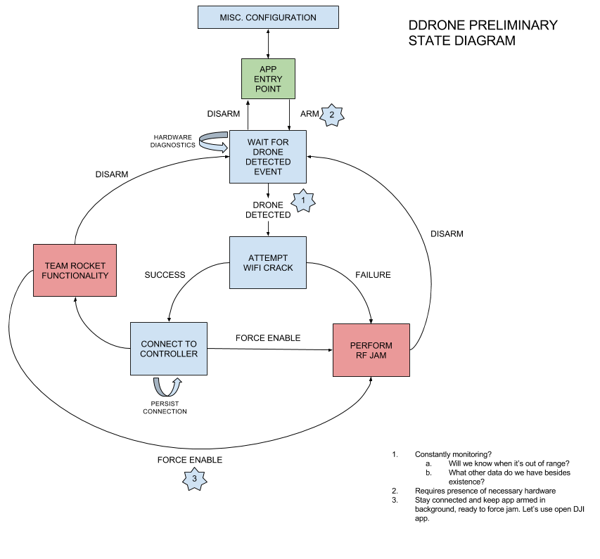
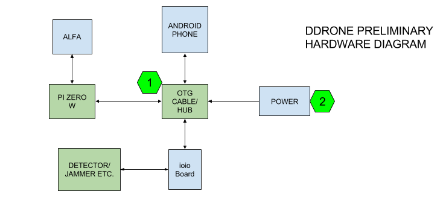

Summary
====================

.. Variables
.. include:: ../vars.rst

Configuration
---------------

.. csv-table:: Software Package Versions
   :header: "Item", "Version", "Description"

   "`Target Android API <android-api-25_>`_",  "``25``", "Android ``7.1`` Nougat"
   "`Minimum Android API <android-api-21_>`_", "``21``", "Android ``5.0`` Lollipop"
   "`Android Build Tools <android-build-tools_>`_", "``25.0.3``", "Released April 2017"
   "`DJI Mobile SDK for Android <dji-mobile-sdk_>`_", "``4.3.2``" , ""
   "`DJI Phantom 3 Standard Firmware <dji-phantom-3-firmware_>`_", "``1.9.20``" , "Added some restrictions when logged out"

.. _android-api-25: https://developer.android.com/about/versions/nougat/android-7.1.html
.. _android-api-21: https://developer.android.com/about/versions/android-5.0.html
.. _android-build-tools: https://developer.android.com/studio/releases/build-tools.html
.. _dji-mobile-sdk: https://github.com/dji-sdk/Mobile-SDK-Android/tree/v4.3.2
.. _dji-phantom-3-firmware: https://forum.dji.com/thread-109020-1-1.html

Summary
---------

|AppName| is an Android application that, when coupled with the necessary hardware, can detect, crack, hijack, and/or RF jam hostile DJI Phantom 3 Standard drones. It can deauthenticate the pilot of an enemy drone, crack the drone's password, and then connect to the drone and force a Return to Home or Land Immediately command. Deauthenticating the pilot destroys his video feed. Forcing the drone to land destroys the threat. |AppName| has several core components:

|AppName| Android Application
~~~~~~~~~~~~~~~~~~~~~~~~~~~~~

The |AppName| Android application itself. Requires an Android device with OTG support for IOIO-OTG board integration.

Raspberry Pi 3 and Alfa USB Network Adapter
~~~~~~~~~~~~~~~~~~~~~~~~~~~~~~~~~~~~~~~~~~~~~~~~

The Alfa wireless adapter is capable of monitor mode, which is required to deauthenticate and ultimately crack the enemy drone based on standard DJI mac addresses.

The Raspberry Pi houses the ddrone-pi scripts, which receive commands from the Android application and perform password cracking. The cracked password is then transmitted to the Android application via bluetooth.

After receiving the password, the Android device will automatically connect to the drone while the Raspberry Pi continues to send deauth packets to the pilot, destroying its video feed and ability to send commands through the DJI GO app. The pilot must then resort to manual LoS flight.

Once connected to the drone, the Return to Home or Land Immediately command can be sent. By expanding the |AppName| Android application (in the future), intel can easily be gathered -- such as retrieving takeoff GPS coordinates, contents of SD cards, MAC address, and other logs that contain information that can ultimately aid in identification of the pilot.

Drone Detecting and Jamming
~~~~~~~~~~~~~~~~~~~~~~~~~~~

The |AppName| Android application is designed to work with the IOIO-OTG board for integration with external hardware. This includes a digital input (for integrating with a drone detector) and a digital output (for integrating with an RF jammer), along with UI components to activate each action.

If a drone is detected, the |AppName| Android application will alert the user using the highest possible alert level in the Android ecosystem (audio, vibration, LEDs if phone-equipped, etc.) The application can then begin scanning and takeover activities, as directed by the user.

This behavior can be simulated by flipping a switch connected to the IOIO.

Should a takeover or crack fail, the user can request a jam and the drone jammer circuitry (designed/provided by SOFWERX) will be activated.

This behavior can be simulated by illuminating an LED connected to the IOIO.

State Diagram
--------------

State is managed using the ``SharedPreferences`` library.

Hardware Diagram
-----------------

